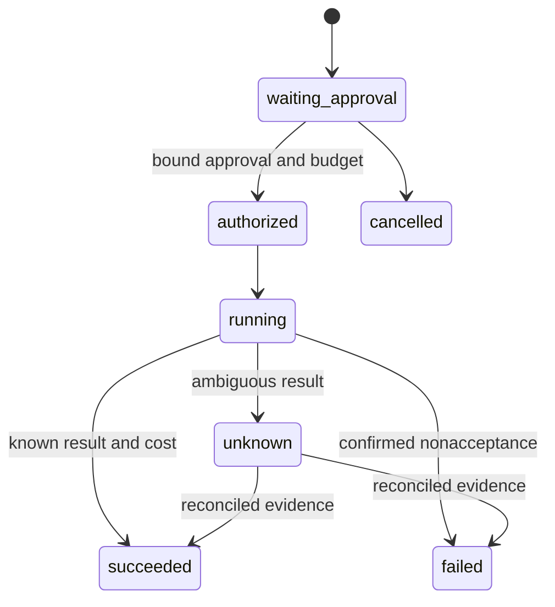

# YCS Conductor Lite

**Safe orchestration layer for AI systems with cost, approval and auditability.**

An executable, offline reference architecture based on the inspected YCS Conductor design. The reference implementation was written for this portfolio excerpt. It is not the production service or a copy of private routing policies.

A provider timeout can mean either failure or accepted work with a lost response. Blind retry can duplicate an operation and its cost. This example treats ambiguity as an explicit state and keeps the cost reservation until evidence resolves it.

## Architecture



| Mechanism | Implemented behavior |
| --- | --- |
| Provider abstraction | `execute({idempotencyKey, operation})`; included provider is synthetic. |
| Approval | Reviewer, project scope and proposal hash must agree before budget reservation and dispatch. |
| Idempotency | Reusing an ID with different content fails; duplicate concurrent calls in one process dispatch once. |
| Cost ledger | Integer cents; pending reservation stays committed during UNKNOWN; actual overruns are recorded. |
| Retry | At most the configured attempts, only for confirmed nonacceptance with zero cost. |
| Event Bus | Pull-driven subscriptions, event-order preservation, subscriber isolation and reported delivery errors. |
| Audit trail | Cloned append-only event snapshots for callers. In-memory state is not a tamper-proof external log. |
| Reconciliation | Scoped evidence reference and matching hash settle UNKNOWN exactly once. |

## Run

Node.js 24 or later; no dependencies, accounts or network requests.

```sh
git clone https://github.com/walteryanko/ycs-conductor-lite.git
cd ycs-conductor-lite
npm test
npm run demo
```

The demo deliberately produces UNKNOWN, then reconciles it using a synthetic receipt. It performs no paid generation. The default mock cost is an example integer, not provider pricing.

## Tested

Fourteen tests cover approval binding, conflicting idempotency keys, concurrent duplicate dispatch, budget reservation, UNKNOWN, reconciliation, safe retry boundaries, invalid costs, actual overruns, snapshot mutation, invalid input, cancellation, ordered event delivery and subscriber failures.

## Limits and trust boundary

The caller is trusted host code. A reviewer string is not authentication, and an evidence reference is not independent verification of a receipt. The production host must supply authenticated identities and verified provider evidence. There is no database, distributed locking, durable outbox, restart recovery, cryptographically signed audit log or distributed exactly-once guarantee. Event delivery is in-memory and at most once; failures are reported without automatic replay. The retry example has an attempt bound but no timed backoff. It handles a narrow synthetic operation and does not contain customer integrations or YCS business policies.

See [provenance](docs/PROVENANCE.md). These limits are deliberate boundaries of the reference, not assertions about production readiness.

## License and product boundary

This repository is a public reference implementation inspired by architectural patterns used in YCS systems. It is not the production YCS Conductor.

MIT covers this independent reference implementation and its original examples and documentation. Production adapters, private routing heuristics, YCS policies, provider credentials, customer integrations and production events are not included.

See [LICENSE](LICENSE) for the unmodified MIT text and [LICENSE_SCOPE.md](LICENSE_SCOPE.md) for scope and branding. `private: true` prevents accidental publication to the npm registry; it does not restrict the public repository's license.

## Continuous verification

The [Verify workflow](.github/workflows/verify.yml) runs the real tests and CLI demo on Node 24. See [GitHub Actions](https://github.com/walteryanko/ycs-conductor-lite/actions) for current run results. No separate lint or static typecheck is configured. Historical local test results describe this excerpt only.
